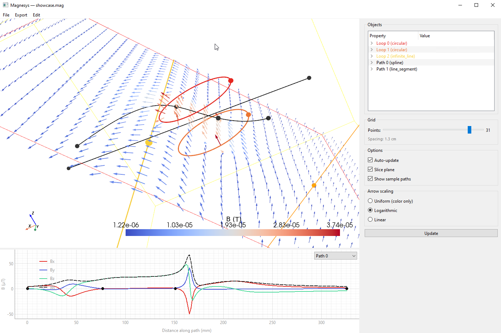

# Magnesys

A Python-based magnetic field simulator with an interactive 3D visualization GUI.



## Features

### Simulation
- **Exact analytical solutions** for circular loops using complete elliptic integrals (machine precision, no numerical integration)
- **Biot-Savart integration** for arbitrary wire geometries (rounded rectangles, extensible to any shape)
- **Arbitrary orientations** — current loops can be placed and oriented anywhere in 3D space
- **Vectorized computation** — field evaluation works on single points or NumPy meshgrids
- **Extensible geometry** — abstract `CurrentLoop` base class with a registration system for adding new loop shapes

### Visualization
- **Interactive 3D viewer** powered by PyVista + Qt, with pan/rotate/zoom
- **Quiver plot** of the magnetic field with three arrow scaling modes (uniform, logarithmic, linear), selectable via radio buttons
- **Draggable slice plane** — compute and display the field on an arbitrary 2D cross-section
- **Sample paths with 2D plot** — three path types (line segment, polyline, spline) with draggable 3D handles; Bx, By, Bz, and |B| plotted vs distance (pyqtgraph), with a dropdown to select which path is displayed
- **Current direction indicators** — arrowheads on each loop showing the direction of current flow
- **Near-wire filtering** — points too close to the wire (where the thin-wire model diverges) are automatically excluded from visualization and color scaling

### GUI controls
- **Objects tree view** — unified list of loops and sample paths with editable properties (double-click to edit). Vectors expand into individual x/y/z components. Changes update the 3D view in real time.
- **Add/delete objects** — Edit menu to add loops (circular, rounded rectangle) and paths (line segment, polyline, spline). Delete via Edit menu, right-click context menu, or Delete key. Polyline/spline points can be added, deleted, or randomized via right-click.
- **Grid resolution slider** with live spacing readout in cm/mm
- **Auto-update toggle** — disable for expensive simulations, use the Update button manually
- **Arrow scaling radio buttons** — switch between uniform, logarithmic (default), and linear

### Project files
- **`.mag` file format** (v3) — human-readable JSON storing simulation, visualization settings, camera position, slice plane state, and multiple sample paths
- **File menu** — Open (Ctrl+O), Save (Ctrl+S), Save As (Ctrl+Shift+S)
- **Export menu** — Export field along path to CSV with configurable sampling interval
- Backward-compatible with v1 (simulation-only) and v2 (single sample path) files

## Supported Geometries

| Type | Class | Field method | Parameters |
|------|-------|-------------|------------|
| Circular loop | `CircularCurrentLoop` | Elliptic integrals (exact) | diameter, center, normal, current |
| Rounded rectangle | `RoundRectCurrentLoop` | Biot-Savart (numerical) | side_lengths, corner_radius, center, normal, orientation, current |
| Infinite line | `InfiniteLineCurrent` | Analytical (exact) | center, normal, current |

## Installation

Requires Python 3.10+.

```bash
py -3.14 -m venv .venv
.venv/Scripts/activate    # Windows
pip install numpy scipy pyvista pyvistaqt PyQt6 pyqtgraph
```

## Usage

### GUI

```bash
# Launch with empty simulation
python magnesys.py

# Open a project file
python magnesys.py demos/helmholtz_coil.mag
```

In the GUI you can:
- **Add loops** via Edit → Add loop → Circular / Rounded rectangle / Infinite line
- **Add sample paths** via Edit → Add path → Line segment / Polyline / Spline
- **Edit properties** by double-clicking values in the Objects tree view
- **Delete objects** by selecting one and pressing Delete (or right-click → Delete)
- **Edit polyline/spline points** — right-click a point for Add before/after, Delete, or Randomize
- **Adjust the field grid** with the resolution slider
- **Enable a slice plane** to see the field on a 2D cross-section (draggable)
- **Show sample paths** to plot Bx, By, Bz, |B| vs distance; select path via dropdown
- **Export field data** along the selected path to CSV via Export → Export field along path
- **Save/open projects** as `.mag` files preserving all settings and camera position

### Python API

```python
import numpy as np
from source import CircularCurrentLoop, RoundRectCurrentLoop, Simulation, Visualizer

# Helmholtz coil pair
R = 0.05
sim = Simulation([
    CircularCurrentLoop(
        diameter=2 * R,
        center=[0, 0, R / 2],
        normal=[0, 0, 1],
        current=1.0,
    ),
    CircularCurrentLoop(
        diameter=2 * R,
        center=[0, 0, -R / 2],
        normal=[0, 0, 1],
        current=1.0,
    ),
])

# Compute field at a point
Bx, By, Bz = sim.magnetic_field_at(0, 0, 0)

# Compute field on a grid
X, Y, Z = np.meshgrid(
    np.linspace(-0.1, 0.1, 50),
    np.linspace(-0.1, 0.1, 50),
    [0.0],
)
Bx, By, Bz = sim.magnetic_field_on_grid(X, Y, Z)

# Open the interactive 3D viewer
Visualizer(sim).show(grid_resolution=8)

# Save / load
sim.save("my_simulation.json")
sim = Simulation.load("my_simulation.json")
```

## Demos

The `demos/` directory contains example scripts and `.mag` project files:

| Demo | Description |
|------|-------------|
| `helmholtz_coil` | Classic Helmholtz pair — nearly uniform field between coils |
| `anti_helmholtz` | Opposing currents — field gradient with zero at center |
| `mixed_geometries` | Circular + rectangular loops in one simulation |
| `tilted_loops` | Three orthogonal coils (3-axis coil system) |
| `rectangular_coil` | Sharp-cornered rectangle with save/load roundtrip |
| `rect_helmholtz_3axis` | Three pairs of rectangular Helmholtz coils |
| `field_along_line` | Sample line with 2D field plot |

Run any demo as a script or open the `.mag` file:

```bash
python demos/helmholtz_coil.py
python magnesys.py demos/helmholtz_coil.mag
```

## Adding New Geometries

For geometries with closed-form field solutions, subclass `CurrentLoop` directly:

```python
@CurrentLoop.register
class MyLoop(CurrentLoop):
    loop_type = "my_loop"
    def magnetic_field(self, x, y, z): ...
    def distance_to_wire(self, x, y, z): ...
    def characteristic_size(self): ...
    def get_path(self, n_points=128): ...
    def to_dict(self): ...
    @classmethod
    def from_dict(cls, data): ...
```

For arbitrary wire shapes, subclass `PathBasedLoop` instead — just implement `get_path()` and serialization, and the Biot-Savart field computation is provided automatically.

## Architecture

```
magnesys.py                      # CLI launcher
source/
    current_loop.py              # Abstract base class + registry
    circular_current_loop.py     # Exact field via elliptic integrals
    infinite_line_current.py     # Exact field for infinite straight wire
    path_based_loop.py           # Biot-Savart base for arbitrary paths
    round_rect_current_loop.py
    path.py                      # SamplePath / LineSegmentPath / PolylinePath / SplinePath
    simulation.py                # Loop collection + field computation
    visualization.py             # Qt GUI + PyVista 3D + pyqtgraph 2D
    project.py                   # .mag file I/O
demos/
    *.py                         # Example scripts
    *.mag                        # Loadable project files
```

## Credits

Developed by **Brian Kardon** and **Claude** (Anthropic).
